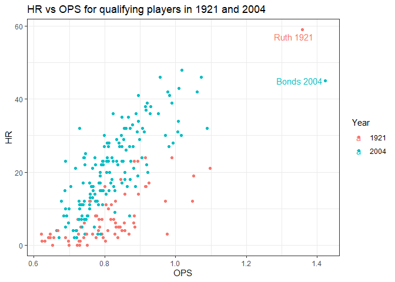

Was Babe Ruth’s 1921 season the best in baseball history?
================
Gabriel Costa and Kevin Cummiskey
12/4/2020

The following analysis uses the R Lahman package which imports Sean
Lahman’s database. The seasons data.frame contains a row for each player
and season from 1871 to 2019 with at least 502 plate appearences.

``` r
#calculate on base percentage, slugging, and OPS
seasons <- seasons %>% 
  mutate(OBP = (H + BB + HBP)/(AB + BB + SF + HBP),
         X1B = H - X2B - X3B - HR,
         SLG = (X1B + 2*X2B + 3*X3B + 4*HR)/AB,
         OPS = OBP + SLG)
```

### The best seasons - OPS

The table below contains the highest OPS seasons in baseball history
(502 PA minimum). While Barry Bonds’ 2004 season had the highest OPS,
Bonds’ relatively few home runs that season make it tough to argue this
season is the best in baseball history. (On a side note, Bonds’ low home
run that season was not his fault - he nearly doubled the previous
record for intentional walks in a season. *it would be interesting to
take these intentional walks and see what his season would have looked
like if his performance on those at-bats was similar to this
others.*)

| playerID  | nameFirst | nameLast | yearID |  AB |  PA |   OPS | HR |   G |   R |   H | X2B | X3B | RBI | SB | CS |  BB | SO | IBB | HBP | SH | SF | GIDP | name          |   OBP | X1B |   SLG |
| :-------- | :-------- | :------- | -----: | --: | --: | ----: | -: | --: | --: | --: | --: | --: | --: | -: | -: | --: | -: | --: | --: | -: | -: | ---: | :------------ | ----: | --: | ----: |
| bondsba01 | Barry     | Bonds    |   2004 | 373 | 617 | 1.422 | 45 | 147 | 129 | 135 |  27 |   3 | 101 |  6 |  1 | 232 | 41 | 120 |   9 |  0 |  3 |    5 | Bonds 2004    | 0.609 |  60 | 0.812 |
| ruthba01  | Babe      | Ruth     |   1920 | 457 | 610 | 1.382 | 54 | 142 | 158 | 172 |  36 |   9 | 137 | 14 | 14 | 150 | 80 |   0 |   3 |  5 |  0 |    0 | Ruth 1920     | 0.533 |  73 | 0.849 |
| bondsba01 | Barry     | Bonds    |   2002 | 403 | 612 | 1.381 | 46 | 143 | 117 | 149 |  31 |   2 | 110 |  9 |  2 | 198 | 47 |  68 |   9 |  0 |  2 |    4 | Bonds 2002    | 0.582 |  70 | 0.799 |
| bondsba01 | Barry     | Bonds    |   2001 | 476 | 664 | 1.379 | 73 | 153 | 129 | 156 |  32 |   2 | 137 | 13 |  3 | 177 | 93 |  35 |   9 |  0 |  2 |    5 | Bonds 2001    | 0.515 |  49 | 0.863 |
| ruthba01  | Babe      | Ruth     |   1921 | 540 | 689 | 1.359 | 59 | 152 | 177 | 204 |  44 |  16 | 171 | 17 | 13 | 145 | 81 |   0 |   4 |  4 |  0 |    0 | Ruth 1921     | 0.512 |  85 | 0.846 |
| ruthba01  | Babe      | Ruth     |   1923 | 522 | 696 | 1.309 | 41 | 152 | 151 | 205 |  45 |  13 | 131 | 17 | 21 | 170 | 93 |   0 |   4 |  3 |  0 |    0 | Ruth 1923     | 0.545 | 106 | 0.764 |
| willite01 | Ted       | Williams |   1941 | 456 | 606 | 1.287 | 37 | 143 | 135 | 185 |  33 |   3 | 120 |  2 |  4 | 147 | 27 |   0 |   3 |  0 |  0 |   10 | Williams 1941 | 0.553 | 112 | 0.735 |
| bondsba01 | Barry     | Bonds    |   2003 | 390 | 550 | 1.278 | 45 | 130 | 111 | 133 |  22 |   1 |  90 |  7 |  0 | 148 | 58 |  61 |  10 |  0 |  2 |    7 | Bonds 2003    | 0.529 |  65 | 0.749 |
| ruthba01  | Babe      | Ruth     |   1927 | 540 | 677 | 1.258 | 60 | 151 | 158 | 192 |  29 |   8 | 164 |  7 |  6 | 137 | 89 |   0 |   0 | 14 |  0 |    0 | Ruth 1927     | 0.486 |  95 | 0.772 |
| willite01 | Ted       | Williams |   1957 | 420 | 546 | 1.257 | 38 | 132 |  96 | 163 |  28 |   1 |  87 |  0 |  1 | 119 | 43 |  33 |   5 |  0 |  2 |   11 | Williams 1957 | 0.526 |  96 | 0.731 |

Highest OPS seasons in baseball history

### Comparing Ruth 1921 to Bonds 2004

The figure below is OPS vs. HRs for qualifying players (502 PAs) in 1921
and 2004. A few observations:

  - There was much less offense in 1921 than 2004.

  - Bonds’ OPS was exceptional. His HR total was not…he finished fourth
    that year.

  - Ruth was exceptional in both.

<!-- -->

### Comparing standardized OPS and HR

Below, we calculate standardized OPS and HRs for player by season. The
standardized OPS is:

\[\frac{OPS - \overline{OPS}}{s_{OPS}}"\]

where \(OPS\) is the player’s OPS that season, \(\overline{OPS}\) is the
league average OPS that season, and \(s_{OPS}\) is the standard
deviation. This gives us a measure of the player’s performance relative
to other players that year.

``` r
#standardized OPS and HRs
seasons <- seasons %>% 
  group_by(yearID) %>% 
  mutate(OPS.mean = mean(OPS),
         OPS.stdev = sd(OPS),
         OPS.std = (OPS - OPS.mean)/OPS.stdev,
         HR.mean = mean(HR),
         HR.stdev = sd(HR),
         HR.std = (HR - HR.mean)/HR.stdev,
         HR_rate = AB/HR)
```

The figure below is standardized OPS and HRs for all qualifying seasons
(502 PAs) in baseball history.

<!-- -->

Questions for Father Costa:

1.  Why not Babe Ruth 1920?

### References

  - Friendly, M., Dalzell, C., Monkman, M., & Murphy, D. (2019). Sean
    Lahman’s Baseball Database. R package version 7.0-1.
