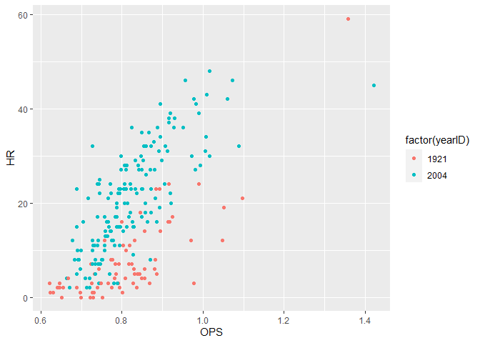

babe
================
Kevin Cummiskey
12/4/2020

``` r
#calculate OBP, slugging, and OPS

seasons <- seasons %>% 
  mutate(OBP = (H + BB + HBP)/(AB + BB + SF + HBP),
         X1B = H - X2B - X3B - HR,
         SLG = (X1B + 2*X2B + 3*X3B + 4*HR)/AB,
         OPS = OBP + SLG)

seasons %>% 
  arrange(-OPS) %>% 
  select(nameFirst,nameLast, yearID, OPS) %>% 
  head()
```

    ## Adding missing grouping variables: `playerID`

    ## # A tibble: 6 x 5
    ## # Groups:   playerID [2]
    ##   playerID  nameFirst nameLast yearID   OPS
    ##   <chr>     <chr>     <chr>     <int> <dbl>
    ## 1 bondsba01 Barry     Bonds      2004  1.42
    ## 2 ruthba01  Babe      Ruth       1920  1.38
    ## 3 bondsba01 Barry     Bonds      2002  1.38
    ## 4 bondsba01 Barry     Bonds      2001  1.38
    ## 5 ruthba01  Babe      Ruth       1921  1.36
    ## 6 ruthba01  Babe      Ruth       1923  1.31

``` r
seasons %>% 
  filter(yearID %in% c(1921,2004)) %>%
  ggplot(aes(x = OPS, y = HR, color = factor(yearID))) +
  geom_point()
```

<!-- -->

``` r
seasons <- seasons %>% 
  group_by(yearID) %>% 
  mutate(OPS.mean = mean(OPS),
         OPS.stdev = sd(OPS),
         OPS.std = (OPS - OPS.mean)/OPS.stdev)

seasons %>% 
  arrange(-OPS.std) %>% 
  select(nameFirst,nameLast, yearID, OPS.std) %>% 
  head()
```

    ## # A tibble: 6 x 4
    ## # Groups:   yearID [6]
    ##   nameFirst nameLast yearID OPS.std
    ##   <chr>     <chr>     <int>   <dbl>
    ## 1 Barry     Bonds      2004    5.87
    ## 2 Babe      Ruth       1920    5.01
    ## 3 Barry     Bonds      2002    4.96
    ## 4 Babe      Ruth       1921    4.56
    ## 5 Barry     Bonds      2003    4.50
    ## 6 Barry     Bonds      2001    4.44
